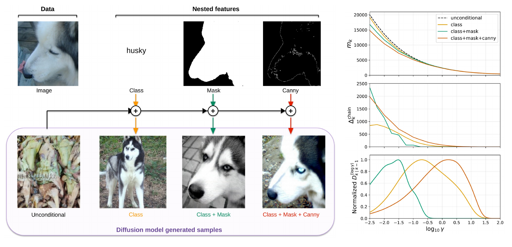
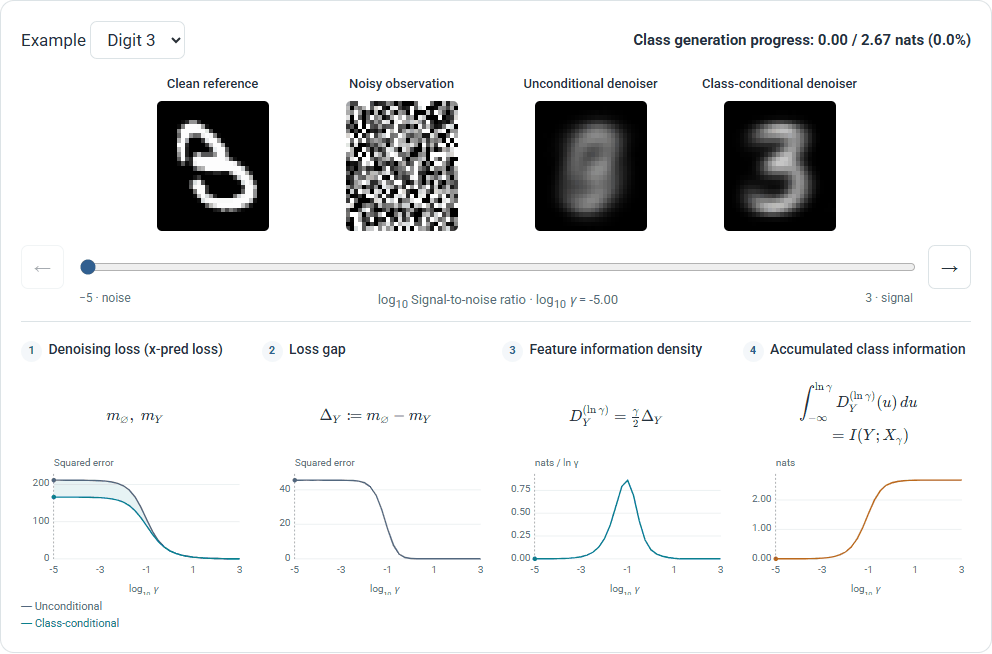

# Feature Information Dynamics in Diffusion<br><sub>Official PyTorch implementation of the NeurIPS 2026 paper</sub>



**Feature Information Dynamics in Diffusion**<br>
Jia-Shu Pan, Tao Zhang, Yufei Huang, Yanjun Sheng, Tailin Wu<br>
[Paper](https://arxiv.org/abs/2610.08626) · [Project Page](https://panjiashu.github.io/feature-information-dynamics/)

Abstract: *Diffusion models generate data through a continuum of denoising problems, and are widely observed to reveal coarse structure before fine detail. Yet, this intuition is mostly empirical and qualitative. We introduce feature information dynamics, an information-theoretic framework for localizing when a feature is generated during diffusion. Using the I-MMSE identity, we connect the rate of feature mutual information change to a gap between optimal unconditional and feature-conditional denoising losses, yielding practical estimators for feature information density. We further develop a chained decomposition that separates shared from incremental information in a feature hierarchy. We use this framework first to quantitatively confirm spectral autoregression in pixel diffusion, and then to extend the analysis beyond frequency: under a class → mask → Canny conditioning chain, the per-feature information densities differ across pixel, SDVAE, VAVAE, and RAE, exposing fundamental differences between these representations and suggesting that ordered generation could be beneficial for training diffusion models.*

## Requirements

- Python **3.10+**.
- The MNIST notebook runs on CPU.

```sh
python -m pip install -e ".[mnist]"
```

## Getting started



For a crash course in **feature information dynamics**, visit the [project page](https://panjiashu.github.io/feature-information-dynamics/). Explore the corresponding implementation in the [MNIST notebook](mnist_information_concepts.ipynb). Recorded CPU execution: **8–18 seconds**, excluding the first data download.

## Feature information dynamics across representations

**Coming soon.**

## License

Project-specific code is [MIT licensed](LICENSE). Upstream notices are retained in [THIRD_PARTY_NOTICES.md](THIRD_PARTY_NOTICES.md).
## Citation

```bibtex
@misc{pan2026featureinformationdynamicsdiffusion,
  title={Feature Information Dynamics in Diffusion},
  author={Jia-Shu Pan and Tao Zhang and Yufei Huang and Yanjun Sheng and Tailin Wu},
  year={2026},
  eprint={2610.08626},
  archivePrefix={arXiv},
  primaryClass={stat.ML},
  url={https://arxiv.org/abs/2610.08626}
}
```
