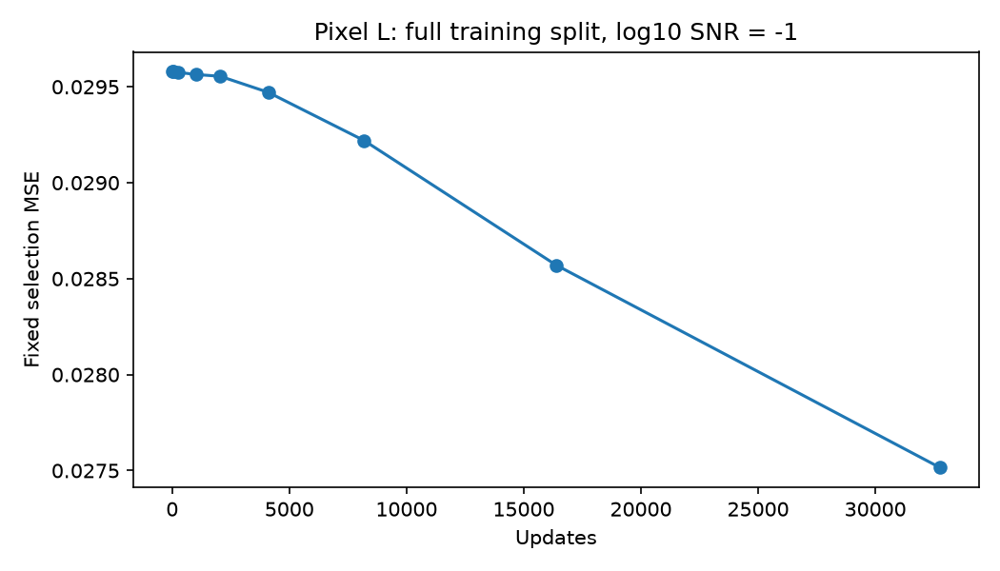

# 完整训练集 Pixel L：32768步结果

32768/32768步完成，GPU已释放。547448图，batch64，约3.83轮；全条件固定log10 SNR=-1，官方预训练初始化。训练与评价约2.48小时（不含初始化加载与最终检查点写入）。

|步数|固定开发验证MSE|
|---|---:|
|0|0.02957851|
|16384|0.02857077|
|32768|0.02751498|

相对起点变化-6.98%，相对16384步变化-3.70%。最终节点是全部已评价节点中最低值，末段仍有改善，未证明收敛。

best.pt约1.8GB、last.pt约5.2GB已在开发机保存；last含优化器。全547448张图mask扫描：184张实际空mask，0缺失/格式错误。

这是单SNR、全条件、128图固定噪声开发验证上的经验风险改善；没有独立确认、置信区间或峰序结论，也不是Bayes MMSE证明。完整数据与早期512图实验的batch、空mask处理也不同，不能当作数据量的严格单因素因果对照。

后续合理方向：继续增加当前模型预算，同时用更大且未参与选择的评价集、多噪声重复确认收益。当前有限预算已结束，未自动追加训练。
