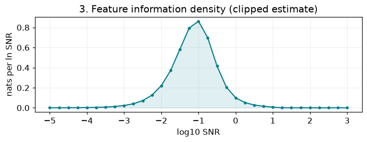
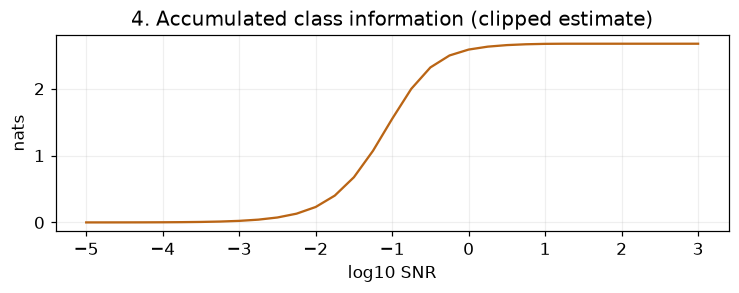

# Validation

The current public layout is organized by representation. SDVAE follows the May
online route; VAVAE follows the original offline sampled-cache route. Validation
checks below have explicit scopes and do not constitute a full paper rerun.

## Scientific implementation

Selected training/evaluation functions were compared with the actual research
source, including native objectives, time sampling, optimizer settings, EMA,
checkpoint chaining and SDVAE's full resume-state restoration. Regression tests
normalize only known relocated import names. Pixel's approved correction targets
trailing image tokens rather than class tokens. Records:
[source mapping](evidence/native_migration/selected_sources.json),
[layout](evidence/native_migration/layout.json),
[upstream review](evidence/native_migration/upstream_review.json).

Official JiT and LightningDiT patches replayed successfully against pinned sources.
RAE core source hashes and the VAVAE tokenizer/source tree match their pins.
Third-party notices are preserved in the package and source tree.

## Bounded execution

Real-model CUDA checks completed forward, native loss, backward, optimization and
EMA for Pixel, RAE, VAVAE and SDVAE. Pixel/RAE/VAVAE used disclosed smaller random
models; SiT used its full XL architecture. Actual JiT block-input assertions show
condition injection leaves class-prefix tokens unchanged and cleans up hooks.
[Pixel record](evidence/native_migration/pixel_runtime.json),
[latent record](evidence/native_migration/latents_runtime.json).

These checks did not exercise real encoder weights, cached normalization on real
images, production phase freezing or distributed checkpoint recovery. The old
records also include the now-removed historical SDVAE offline route; they are
not new executions after directory relocation. Current public command imports:
[9 entrypoints](evidence/native_migration/layout_imports.json).

## Teaching notebook and project page

Windows/Python 3.12.14 fresh reader-directory run: 13 code cells, zero errors,
18.17 seconds, including downloading MNIST without using ignored local data.
[Notebook execution](evidence/public_readiness_notebook.json).
The selected model and measured errors are hash checked. Saved errors cover all
10000 test images with two noise repeats. The raw finite-range integral is
2.625762 nats versus test-label entropy 2.300848 nats, so it is an approximation,
not an exact Bayes result. [Recorded diagnostic](../examples/mnist_class/validation.json).

The project-page checker passed local links, 76 asset hashes, identical notebook
download and shared numerical curve semantics. Run `tools/export_mnist_webpage.py`
first to regenerate ignored `runs/mnist_webpage` inputs for the checker. Clipped display and signed raw
diagnostics remain distinct.

## Prepared-data workflow

`data download`, `verify` and `configure` provide the reader entrypoint. HTTP
fixtures install data, shut down the source server, then verify and configure
from the locally saved manifest. Gzip download/installed hashes, atomic failure,
resume, path checks and optional VAVAE installation are covered. The manifest
builder consumes existing prepared files and is exercised with the real installer.
Historical masks without their own sidecars or embedded labels are supported.

The public RGB reader was also run read-only on actual historical data: the full
547448 training and 66686 validation filenames were indexed, and first/middle/last
samples from each list loaded RGB, mask and Canny with correct shapes and global
labels. It required no VAVAE latent directory or SAM import.
[Actual reader record](evidence/downloaded_data_readers.json).
The public VAVAE offline reader also loaded first/middle/last samples from each
historical split, with saved channel normalization and matching condition maps.
These checks used historical lists, including their known single overlap; they do not
claim a newly published disjoint dataset or a fresh full model-training run.

The [Hugging Face dataset](https://huggingface.co/datasets/AI4Science-WestlakeU/feature-information-dynamics) and organization collection exist. Common payloads and manifest are published; optional VAVAE upload is in progress on the source server; no large arrays were transferred to Windows. Deterministic gzip staging preserves original bytes and records both transport and installed SHA256. Common has 196 files (3,344,352,304 compressed bytes); VAVAE has 129 files (39,500,888,780 compressed bytes). The release explicitly removes the validation occurrence of the one historical overlap: train 547448, validation 66685, total 614133. The 980 invalid mask sentinels remain unchanged. The full raw-image preprocessing code and records are archived locally; the reader guide starts at [prepared data](data.md).

## Packaging and tests

All 45 tests passed in 24.414 seconds on the local Windows environment, including seven publication tests for deterministic compression, resume, concurrent uploads, retries and publishing the manifest only after payload verification. [Local execution record](evidence/local_run_checks.json) also records three successful command-entrypoint checks. Current tests cover scientific functions, teaching examples, native import/layout
contracts and prepared-data installation/configuration. VAVAE alignment checks are included. The final wheel built and its data CLI
loaded outside the workspace; archived raw-image preparation modules are absent. Pixel warmup/mask recipes were copied from actual production
configs with only resource/output fields changed. A separate RAE model template
preserves stage-1/stage-2 architecture and exposes local weight paths.

The wheel is checked outside the workspace. Third-party MIT notices are retained;
root data/run paths are ignored while the source data package is included. No
commit, push or deployment has been performed.

## Completion audit: prepared-data reader path

| Requirement | Current evidence / status |
| --- | --- |
| Start from prepared data, without SAM or extraction | CLI and wheel contain `data` installation/configuration; preprocessing modules are archived and absent from the wheel |
| Online representations do not require VAVAE caches | Common-only fixtures pass; actual RGB reader indexes both full historical lists and loads six samples without a latent path |
| VAVAE uses its original offline cache | Header/label/flip/alignment checks pass; actual reader loads six normalized latent samples and their spatial conditions |
| Run the stages in order with preserved recipes | Pixel warmup/mask/canny templates exist; resource-only configuration tests pass; previous native CUDA checks cover loss/backward/optimizer/EMA with disclosed scope |
| Reader can obtain the release package | Common release published and full public download/verification plus six actual RGB-reader samples passed; optional VAVAE transfer remains in progress |

The user authorized publication to Hugging Face. The common component has been publicly downloaded and verified: 196 files, no reused local files, full corrected splits and six actual reader samples. This took 7244.35 seconds on the source server through its proxy. [Public download record](evidence/huggingface_common_download.json). Optional VAVAE transfer remains in progress. Further public download checks were cancelled at the user's request; release checks use remote payload identities, local code tests and existing-data reader evidence. Full production training has not been repeated.
